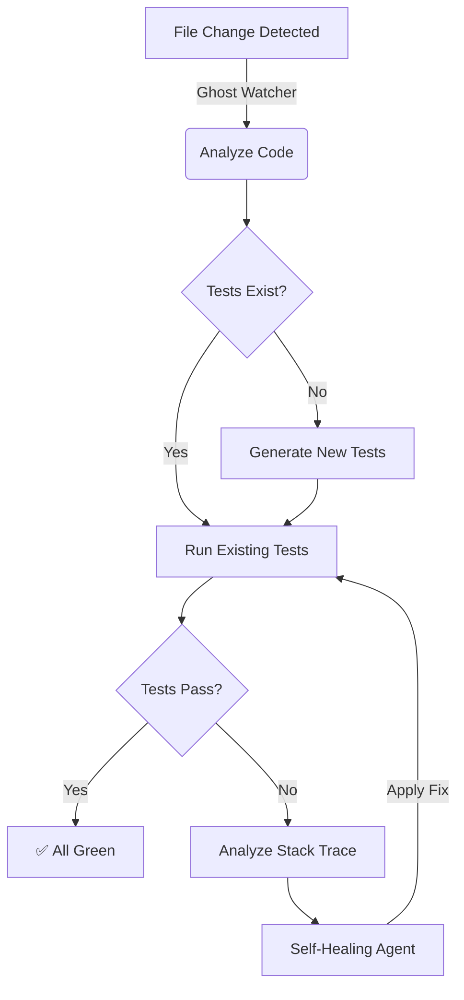

# Ghost

[](https://pypi.org/project/ghosttest/)
[](https://pypi.org/project/ghosttest/)
[](LICENSE)
[](https://github.com/psf/black)

<p align="center">
  
</p>

<p align="center">
  <b>Autonomous Test Generation & Self-Healing for Python</b>
</p>

<p align="center">
  Ghost is an intelligent agent that lives in your terminal. It watches your codebase, automatically generates comprehensive test suites, and—most importantly—<b>fixes them when they fail</b>.
</p>

---

## The Workflow

Ghost operates on a continuous feedback loop, ensuring your tests are always green without manual intervention.



## Key Capabilities

### Autonomous Generation
Ghost analyzes your Python source code to understand its logic, edge cases, and types. It then generates a complete test suite covering happy paths, error conditions, and boundary cases in any framework.

### Self-Healing Engine
When a test fails, Ghost doesn't just report the error. It captures the stdout, stderr, and stack trace, feeds them back into the LLM, and generates a patch to fix the test code. It repeats this process until the test passes.

### Real-time Watcher
Designed to run in the background. Ghost uses `watchdog` to monitor file system events. As soon as you save a file, Ghost triggers the testing cycle, providing immediate feedback.

### Multi-Provider Architecture
Ghost is built to be model-agnostic. It supports (with your API keys):
*   **Groq**: For ultra-low latency feedback loops (recommended for watch mode).
*   **OpenAI**: GPT for complex reasoning and difficult test scenarios.
*   **Anthropic**: Claude for high-quality, idiomatic code generation.
*   **Ollama**: For local, privacy-focused development using Llama 3 or DeepSeek.


## Installation

### Using pip (Standard)

```bash
pip install ghosttest
```

### Using uv (Fastest)

```bash
uv pip install ghosttest
```

### From Source

```bash
git clone git@github.com:tripathiji1312/ghost.git
cd ghost
pip install -e .
```

## Getting Started

1.  **Initialize Ghost**
    Run the initialization command in your project root. This creates a `ghost.toml` configuration file.

    ```bash
    ghost init
    ```

2.  **Configure API Keys**
    Export your API keys as environment variables or add them to a `.env` file.

    ```bash
    export OPENAI_API_KEY=sk-...
    # or
    export GROQ_API_KEY=gsk_...
    ```

3.  **Start Watching**
    Launch the daemon. Ghost will now monitor your project.

    ```bash
    ghost watch
    ```

## Command Line Interface

| Command | Arguments | Description |
|:--------|:----------|:------------|
| `ghost init` | `[PATH]` | Initializes a new Ghost configuration in the specified directory. Defaults to current directory. |
| `ghost watch` | `[PATH]` | Starts the file watcher daemon. Monitors for changes and triggers the test/heal loop. |
| `ghost generate` | `<FILE>` | Manually triggers test generation for a specific Python file. |
| `ghost config` | N/A | Opens an interactive configuration wizard to set providers, models, and paths. |
| `ghost providers` | N/A | Lists all currently supported AI providers and available models. |
| `ghost version` | N/A | Displays the current installed version of Ghost. |

## Configuration

Ghost is highly configurable via `ghost.toml`.

```toml
[ghost]
# The AI provider to use (openai, anthropic, groq, ollama)
provider = "openai"

# The specific model identifier
model = "gpt-4o"

# Directory where tests should be generated
test_dir = "tests"

# Maximum number of healing attempts before giving up
max_retries = 3

# List of files or directories to ignore
ignore = [
    "setup.py",
    "migrations/"
]
```

## License

Distributed under the MIT License. See `LICENSE` for more information.
