<div align="center">


**Autonomous Test Generation & Self-Healing Agent for Python**

[](https://pypi.org/project/ghosttest/)
[](https://pypi.org/project/ghosttest/)
[](LICENSE)
[](https://github.com/psf/black)

</div>

---

## Overview

Ghost is a **local-first AI Agent** designed to automate the unit testing lifecycle for Python applications. It functions as a background daemon that monitors file system events in real-time.

Unlike standard code generators, Ghost employs a **continuous feedback loop**. When source code changes, Ghost analyzes the Abstract Syntax Tree (AST), generates context-aware `pytest` suites, executes them in a secure subprocess, and autonomously patches the tests if they fail due to syntax or import errors.

It is designed for privacy and speed, with native support for **Ollama** (local LLMs), **Groq** (low-latency inference), OpenAI, and Anthropic.

---

## ⚡ Demonstration

### Continuous Watch Mode
*Ghost detects a file save, generates a test, identifies a syntax error, and autonomously heals the test code.*


### Project Initialization
*Setting up the environment and scanning project context.*


---

## Key Features

### 🔍 Context-Aware Generation
Ghost uses AST parsing to build a dependency graph of your project. This ensures that generated tests use correct relative imports, class instantiations, and function signatures, significantly reducing "hallucinated" code common in generic AI tools.

### 🛡️ Self-Healing Engine
The agent allows for autonomous error resolution. If a generated test fails:
1.  **Capture:** Ghost intercepts `stdout`, `stderr`, and Python stack traces.
2.  **Analyze:** The error context is fed back into the LLM.
3.  **Patch:** Ghost applies a fix to the test file (e.g., fixing imports, mocking missing dependencies).
4.  **Verify:** The test is re-run to confirm the fix.

### ⚖️ The "Judge" Protocol
To prevent "testing the implementation" (where tests are modified to match buggy code), Ghost implements a Logic verification step.
*   **Syntax/Runtime Errors:** Automatically fixed.
*   **Assertion Errors:** Analyzed by a secondary "Judge" agent. If the Judge determines the *source code* is likely buggy, Ghost halts and alerts the developer rather than altering the test expectation.

### 🔒 Local & Private
Ghost supports **Ollama** and **LM Studio**, allowing you to run models like Llama 3 or DeepSeek locally. Your source code never leaves your machine.

---

## Installation

Ghost is available on PyPI as `ghosttest`. We recommend installing it via `uv` or `pip`.

### Global Installation (Recommended)
Using `uv` allows you to run Ghost as a standalone command-line tool.

```bash
uv tool install ghosttest
```

### Standard Installation

```bash
pip install ghosttest
```

---

## Usage Guide

### 1. Initialization
Navigate to your project root and initialize the configuration. This creates a `ghost.toml` file and performs an initial scan of your project structure.

```bash
ghost init
```

### 2. Configuration
If using cloud providers, export your API keys. For local usage (Ollama), this step is not required.

```bash
# For Groq (Recommended for speed)
export GROQ_API_KEY=gsk_...

# For OpenAI
export OPENAI_API_KEY=sk-...
```

### 3. Start the Daemon
Start the file watcher. Ghost will now run in the background.

```bash
ghost watch
```

---

## Configuration

Ghost is configured via a `ghost.toml` file in your project root.

```toml
[project]
name = "my-application"
language = "python"

[ai]
# Options: groq, ollama, openai, anthropic, lmstudio
provider = "groq"
model = "llama-3.3-70b-versatile"
rate_limit_rpm = 30

[scanner]
# Directories to exclude from context analysis
ignore_dirs = [".venv", "node_modules", "dist", "__pycache__"]
ignore_files = ["setup.py", "conftest.py"]

[tests]
framework = "pytest"
output_dir = "tests"
auto_heal = true       # Enable automatic error fixing
max_heal_attempts = 3  # Prevent infinite repair loops
use_judge = true       # Enable logic verification logic
```

## CLI Reference

| Command | Description |
| :--- | :--- |
| `ghost init` | Initializes Ghost configuration and context map in the current directory. |
| `ghost watch` | Starts the daemon to monitor file changes and trigger workflows. |
| `ghost generate <file>` | Manually triggers generation for a specific file. |
| `ghost config` | Opens the interactive configuration wizard. |
| `ghost providers` | Lists supported AI providers and checks connectivity. |
| `ghost doctor` | Verifies installation, dependencies, and environment health. |

---

## Architecture

The following diagram illustrates the decision logic Ghost employs when a file modification event is detected.

```mermaid
graph TD
    A[File Event Detected] -->|Watchdog| B(Context & AST Analysis)
    B --> C[Generate Test Suite]
    C --> D[Execute Pytest]
    D --> E{Execution Result}
    E -- Pass --> F[✅ Success]
    E -- Fail --> G[Capture Error Trace]
    G --> H{Error Classification}
    H -- Syntax/Import --> I[Self-Healing Agent]
    H -- Logic/Assertion --> J[Judge Agent Analysis]
    J --> K{Verdict}
    K -- "Fix Test" --> I
    K -- "Bug in Code" --> L[🚨 Alert User]
    I --> D
```



---

## Contributing

Contributions are welcome. Please refer to `CONTRIBUTING.md` for guidelines on setting up the development environment.

1.  Fork the repository.
2.  Create a feature branch (`git checkout -b feature/new-capability`).
3.  Commit your changes (`git commit -m 'Add new capability'`).
4.  Push to the branch (`git push origin feature/new-capability`).
5.  Open a Pull Request.

## License

This project is licensed under the MIT License - see the [LICENSE](LICENSE) file for details.
